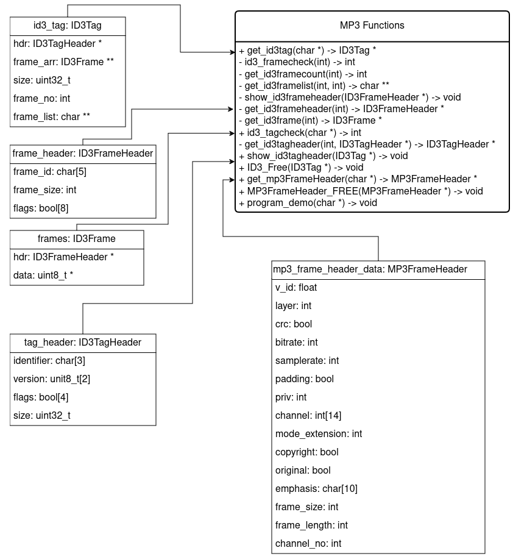

# audio-metadata-reader

## About the Project

A exif-inspired tool/library to read metadata from audio files. It prints text information onto the terminal and can also recreate image data for viewing

### Supported Formats

- **MP3**
- **FLAC**

---

## Guide

### Usage

Run the following command, passing the path to the audio file:

```bash
bin/metadata-reader <path-to-audio-file>
```

The program provides options such as:

- Printing metadata information.
- Printing the audio frame data.
- Extracting and saving album art to `/tmp` for viewing.

---

### Demo

- **Viewing lyrics**  
  

- **Viewing an image stored in the song metadata**  
  

---

## To-Do

1. **MP3 Frame List Explanation**  
   - Currently, users need to look up frame codes (e.g., `APIC` for image data) to understand what each code means
   - Add explanations of each code directly to the output.

2. **MP3 Frame Header Reading**  
   - This functionality is not yet implemented (`mp3_lut.c`).

3. **Image Format Support**  
   - Currently limited to only JPEG files.  
   - Add support for additional image formats.

4. **Consistent naming for functions**  
   - Some functions start with id3 and others with ID3.

5. **Update README to include updated Menu-driver program**  
   - Option showing MP3FrameHeader is not present in the webp.

6. **Add support for other music formats**
    - ogg
    - wav
    - m4a
    - aiff

---

## Using as a Library

Functions available for external usage are marked with a **`+`** symbol.

### MP3 Functions

#### MP3 Structs and Functions Diagram



1. **`get_id3tag(char *filename) -> ID3Tag*`**  
   - Accepts the path to an MP3 file.  
   - Returns an `ID3Tag` struct if an ID3 tag is present.  
   - Returns `NULL` if no ID3 tag is present.

2. **`ID3_Free(ID3Tag *tag) -> void`**  
   - Releases memory allocated for an `ID3Tag` struct.  
   - Call this function when the struct is no longer needed.

3. **`id3_tagcheck(char *filename) -> int`**  
   - Checks for the presence of an ID3 tag in the file.  
   - Returns `1` if present, otherwise `0`.

4. **`show_id3tagheader(ID3Tag *tag) -> void`**  
   - Prints ID3 tag header information to the terminal.

5. **`get_mp3FrameHeader(char *filename) -> MP3FrameHeader*`**  
   - Accepts the path to an MP3 file.  
   - Returns a `MP3FrameHeader` struct if file is MP3.
   - Returns `NULL` if file is not MP3.

6. **`MP3FrameHeader_FREE(MP3FrameHeader *mfhd) -> MP3FrameHeader*`**  
   - Releases memory allocated for a`MP3FrameHeader` struct.  
   - Call this function when the struct is no longer needed.

7. **`program_demo(char *filename) -> void`**  
   - Menu-driven program that prints ID3 tag and MP3FrameHeader information.  
   - Can serve as a reference for using the `ID3Tag` and `MP3FrameHeader` struct.

---

### FLAC Functions

#### FLAC Structs and Functions Diagram


1. **`get_FLACMetadata(char *filename) -> FLACMetadata`**  
   - Accepts the path to a FLAC file.  
   - Returns a `FLACMetadata` struct containing metadata.

2. **`clean_FLACMetadata(FLACMetadata *metadata) -> void`**  
   - Frees memory allocated for a `FLACMetadata` struct.  
   - Call this function when the struct is no longer needed.

3. **`flac_check(char *filename) -> int`**  
   - Checks if the file is a valid FLAC file.  
   - Returns `1` if valid, otherwise `0`.

4. **`view_FLACMetadata(char *filename) -> void`**  
   - Menu-driven program that prints FLAC metadata.  
   - Can serve as a reference for using the `FLACMetadata` struct.

